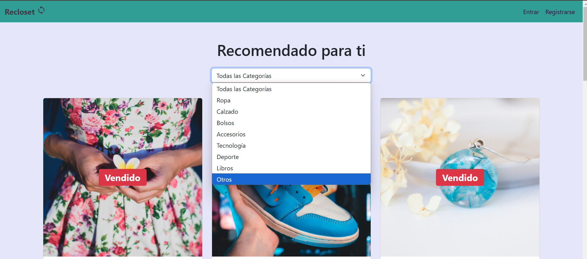
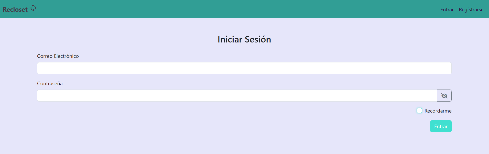
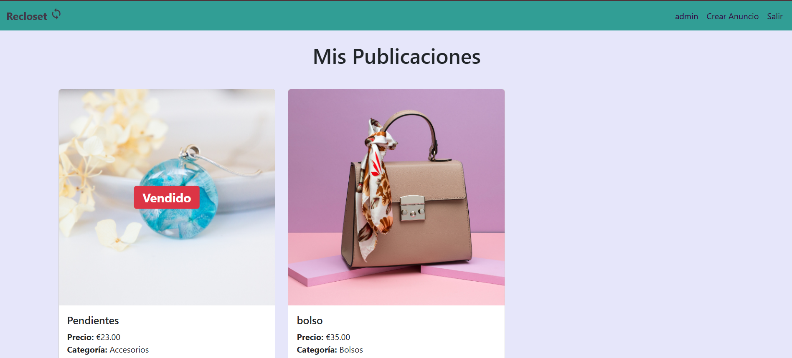
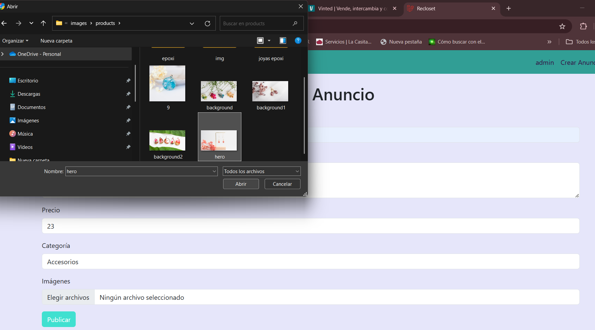
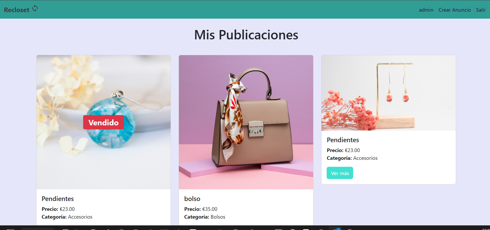
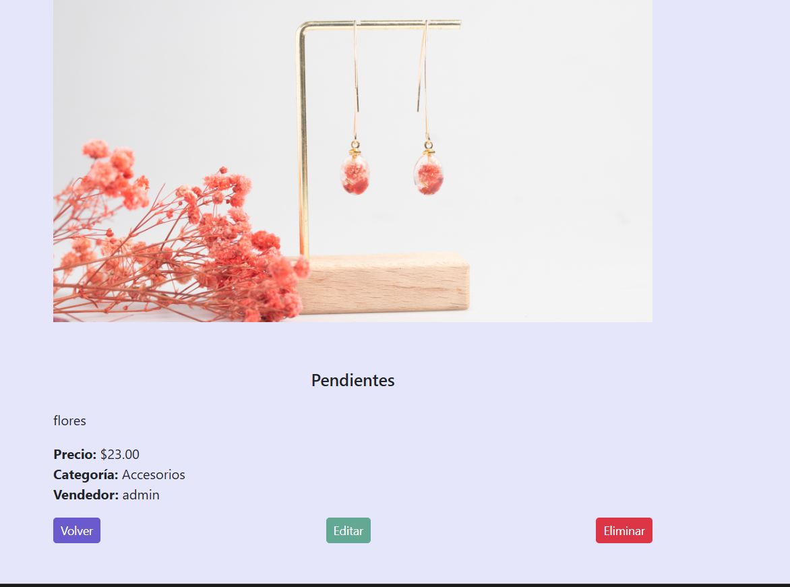
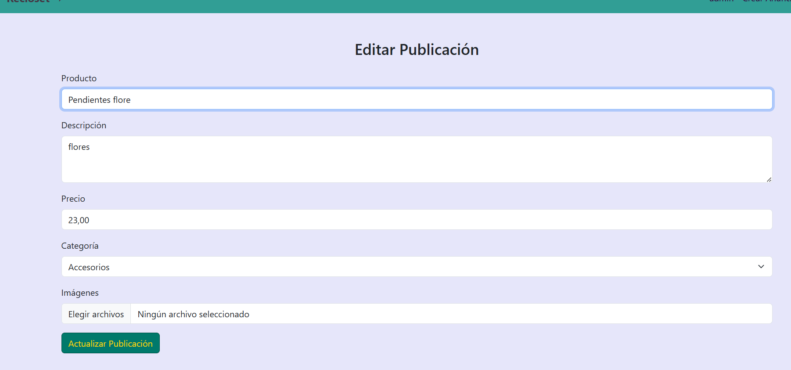
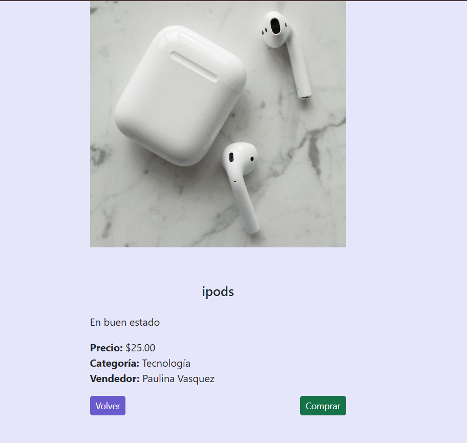
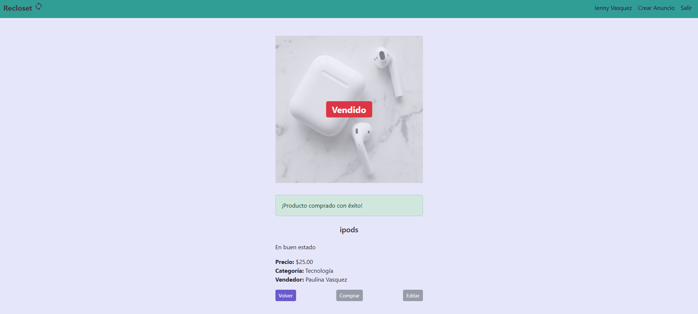

# Recloset

## Descripción
**Recloset** es una plataforma en línea para la compra y venta de ropa de segunda mano, promoviendo la moda sostenible y el consumo responsable. Nuestra misión es dar una nueva vida a prendas en buen estado, reduciendo el impacto ambiental de la industria textil y fomentando la economía circular.

## Características Principales
- **Compra y venta de ropa de segunda mano** con descripciones.
- **Sistema de categorías** para una búsqueda rápida y sencilla.
- **Marcado de prendas vendidas** para mayor transparencia.
- **Interfaz intuitiva y amigable** para una mejor experiencia de usuario.
- **Edición de productos por el propietario**: los usuarios pueden editar los productos que han subido a la plataforma.
- **Restricción de acceso**: solo los usuarios logueados pueden ver los detalles del producto y realizar compras.

## Instalación
1. Clona este repositorio:
   ```bash
   https://github.com/Jenny-Vasquez/ReclosetApp.git
   ```
2. Accede al directorio del proyecto:
   ```bash
   cd recloset
   ```
3. Instala las dependencias:
   ```bash
   composer install
   ```
4. Configura el archivo **.env** con la información de la base de datos.
5. Ejecuta las migraciones:
   ```bash
   php artisan migrate
   ```
6. Configura el almacenamiento de archivos:
   ```bash
   php artisan storage:link
   ```
7. Inicia el servidor de desarrollo:
   ```bash
   php artisan serve
   ```

## Tecnologías Utilizadas
- **Laravel** (Backend)
- **Bootstrap** (Frontend)
- **MySQL** (Base de datos)

## Imagenes de la App












**Recloset** - Moda sostenible al alcance de todos. 🌱

## Autor
Desarrollado por **Jenny Vásquez**
